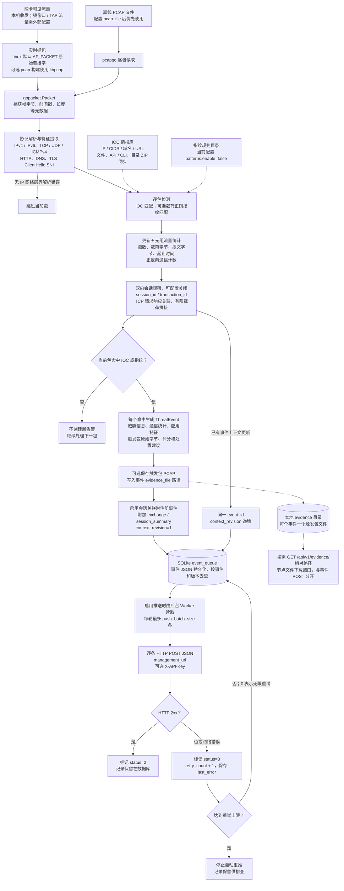
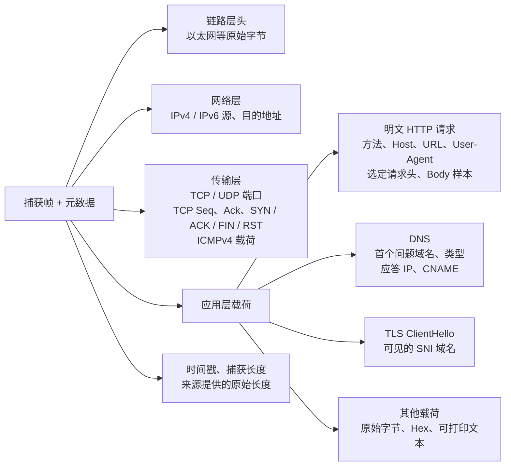
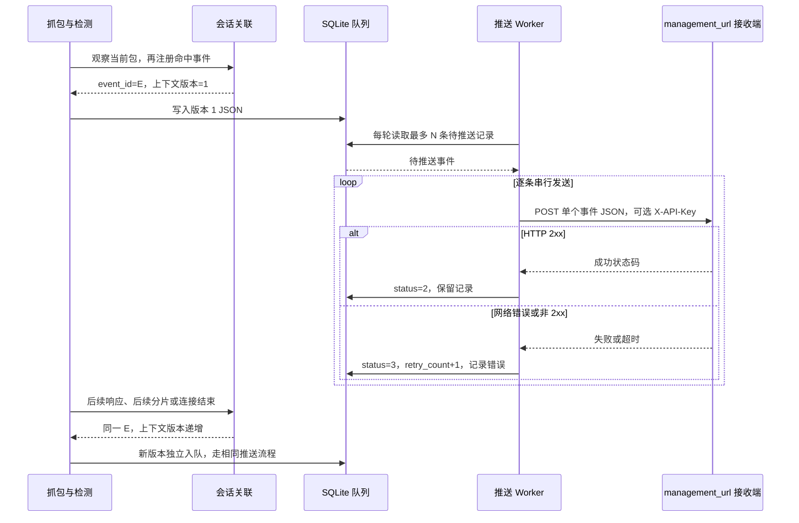

# ta_node 流量采集、检测与推送流程

依据当前工作区代码及 `configs/ta_node.yaml` 整理，日期：2026-09-18。下列参数是仓库配置示例，实际运行以加载的配置文件和命令行参数为准。

## 1. 总流程图

匹配、流统计、会话观察按图中的先后顺序在主循环中执行。会话模块可以用未命中的后续包补齐已有事件，但只有当前包命中时才创建新的事件。一次报文命中多个 IOC 或规则，可以产生多条事件；同一流反复命中也会产生新的事件 ID，并非整条会话只推送一次。

## 2. 如何捕获原始流量

| 入口 | 当前实现 | 关键边界 |
| --- | --- | --- |
| 实时网卡 | 默认 Linux 构建通过 `AF_PACKET + SOCK_RAW + ETH_P_ALL` 绑定指定网卡；通过 gopacket 输出数据包 | 需要抓包权限。示例网卡 `eth0`，混杂模式开启，`snaplen=1600` 字节；只能看到到达该网卡的流量，程序不配置交换机镜像 |
| libpcap 网卡 | 使用 `-tags pcap` 构建，调用 `pcap.OpenLive` | 支持 `bpf_filter`；默认 AF_PACKET 构建遇到非空 BPF 表达式会报错 |
| 离线 PCAP | `pcapgo.NewReader`，保留文件中的时间戳及捕获长度等信息 | 配置 `capture.pcap_file` 时优先于网卡；当前读取实现不应用传入的 BPF 字符串 |

“原始包”指实际捕获到的字节，可能受 snaplen 或输入文件截断影响。默认 AF_PACKET 实现将捕获长度和原始长度都设为 `Recvfrom` 返回长度，不能据此可靠识别被 snaplen 截断的原始帧。

## 3. 流量包含什么，提取什么

| 数据类别 | 提取与用途 |
| --- | --- |
| 原始帧 | 保存捕获到的完整帧字节；链路层头留在原始包中，未单独输出 MAC、VLAN 等事件字段 |
| 五元组 | 源 IP、目的 IP、源端口、目的端口、协议；用于流统计、会话定位以及 IP/CIDR 情报匹配 |
| HTTP | 请求方法、Host、URL、User-Agent、允许列表中的请求头和最多前 64 字节 Body 样本；指纹可匹配请求头、Body 或本包载荷 |
| DNS | UDP DNS、单包完整的 TCP/53 DNS；域名与 CNAME 匹配域名 IOC，应答 IP 也参与 IP/CIDR 匹配 |
| TLS | 尝试从单包 ClientHello 中提取 SNI，用于域名 IOC 匹配；不解密 HTTPS 业务正文 |
| 载荷证据 | 触发包载荷输出为 Hex；可打印 UTF-8 载荷同时输出文本；应用层摘要样本通常最多 64 字节 |
| 捕获元数据 | 微秒时间戳、捕获长度和来源提供的原始长度；全局包序号在流统计阶段生成 |

HTTP、DNS、TLS 特征均按实际可解析内容填充，不保证每包都有。检测匹配发生在会话拼接之前，拼接后的内容不会再次送回 IOC 或指纹匹配器。会话拼接用于补充事件证据，并非完整 TCP 协议栈重组；缺口、乱序或容量限制会标注不完整或截断。

## 4. 检测与事件加工

| 阶段 | 当前处理 |
| --- | --- |
| IOC 匹配 | 源/目的 IP、DNS 应答 IP 匹配 IP/CIDR；DNS 查询、HTTP Host、TLS SNI、CNAME 匹配域名及子域；HTTP URL 做精确/包含匹配；过滤禁用和过期情报 |
| 指纹匹配 | 根据协议、端口、HTTP 条件筛选正则规则，再匹配当前包的对应载荷；示例配置关闭该功能 |
| 流量统计 | 单向五元组累计包数、载荷字节数、报文字节数、起止时间，同时累计规范化端点对的双向统计；示例空闲回收阈值 120 秒 |
| 会话关联 | 示例配置启用 `mode=session` 和 `enable_transaction_link=true`；TCP 请求响应关联，保留有限包证据及拼接载荷，补发更高上下文版本 |
| 告警生成 | 每个 IOC/指纹命中形成事件；补充设备、威胁类型、严重级别、来源、方向、应用特征、通信量、本地窗口命中次数、评分依据与处置建议 |
| 本地证据 | 默认开启 PCAP 保存，保存当前触发包；不是全流量录制，也没有把完整会话写入 PCAP 的实际调用链 |
| 队列持久化 | 事件 JSON 写入 SQLite；事件 ID 与上下文版本组合成内部唯一键，允许同一事件的多个版本分别入队 |

双向统计中的端点定义需区分：基础 `flow.PairStats` 按 IP/端口排序区分两侧；会话 Tracker 尝试根据 TCP SYN 和消息方向识别客户端。处置建议是上报数据，当前链路没有执行防火墙封禁。

## 5. 推送什么、如何推送

推送内容是 `ThreatEvent`（当前 schema 为 `1.6`）的 JSON 对象：

| 内容 | 代表字段 |
| --- | --- |
| 事件身份 | `event_id`、`device_id`、`event_time`、`occurrence_time`、`schema_version`、`sensor_version` |
| 威胁与命中 | `event_type`、`severity`、`model`、`threat_source`、`ioc_*` 或 `rule_id` |
| 通信与统计 | `src_ip`、`dst_ip`、端口、`proto` / `protocol`、`direction`、`packets`、`bytes`、`wire_bytes`、`local_hit_count` |
| 应用层摘要 | `app`：HTTP、DNS、TLS SNI、载荷样本等可获得的特征 |
| 原始触发包 | `raw_packet.packet_hex`、`payload_hex`、`payload_text`、捕获时间、长度、包序号 |
| 双向上下文 | `session_id`、`transaction_id`、`context_revision`、`context_final`、`exchange`、`session_summary`；按启用情况及观测结果提供 |
| 辅助分析与证据 | `severity_basis`、`action_hints`、可用的量化字段，以及保存成功后的 `evidence_file` 本地路径 |

当前示例推送配置：

| 参数 | 值 / 含义 |
| --- | --- |
| `node.management_url` | `http://127.0.0.1:8080/traffic/internal/event/push`，可配置为实际管理平台地址 |
| `event.enable_push` | `true`；关闭时仍可入队，但不启动推送 Worker |
| `event.push_batch_size` | `100`；每轮从队列读取最多 100 条，每条一次 POST，不是一个 JSON 数组批量提交 |
| `event.retry_interval_sec` | `30`；Worker 启动后先处理一轮，再等待 ticker 进行后续轮询；不是单独按每条事件计时，也没有指数退避 |
| `event.push_timeout_sec` | `5` 秒，每次 HTTP 请求超时 |
| `event.max_push_retry` | `20`；失败计数达到 20 后停止自动重推，`0` 表示不限 |
| `node.api_key` | 非空时作为 `X-API-Key` 请求头发送 |
| `event.queue_db` | `./data/event_queue.db`；成功或失败达到上限的记录当前都保留 |

接收端返回任意 HTTP 2xx 即视为推送成功，代码不验证响应正文中的业务成功字段。网络重试可能使接收端重复收到同一事件版本；接收端需要识别 `event_id` 和 `context_revision`，具体接收处理不在本仓库中。

PCAP 文件本身不随 POST 上传；开启节点 HTTP 服务后，可以通过 `GET /api/v1/evidence/<相对 evidence 目录的路径>` 单独下载。示例监听 `127.0.0.1:19090`，远程访问需要另行提供可达地址或代理。正常抓包主链路在保存 PCAP 后回填的是 `evidence_file`；不能据 `evidence_files` 类型定义推定每条事件都有完整下载链接。

## 6. 阅读流程图时的边界

- 非命中报文也参与流统计和已启用的会话观察；它们不会独立生成告警，但可能作为已有告警的请求/响应证据被推送。
- `raw_packet` 和 `exchange` 含原始帧、载荷或拼接内容；`app.http_headers` 的允许列表不代表整条事件的原始内容已经脱敏。
- 响应等待示例值为 30 秒，超时检查由后续包驱动；PCAP 结束或退出时会 Flush 上下文到队列，但主循环不等待推送队列全部发送完。
- `exchange.response_status=complete` 当前表示已观察到响应包，不等同于完整会话证据；还应结合 `context_final`、`truncated`、`reassembly_incomplete` 判断。
- 配置项 `save_full_session_pcap` 未接入当前证据保存调用链，不能视为已实现的全会话录制功能。

## 7. 代码定位

| 环节 | 文件与入口 |
| --- | --- |
| 主处理顺序 | `cmd/ta_node/main.go`：`runNode`、`openSource`、`enqueueContextUpdates` |
| 抓包 | `internal/capture/interface_capture_linux.go`、`interface_capture_pcap.go`、`pcap_reader.go` |
| 特征提取 | `internal/parser/parser.go`：`Parse`、`parseHTTP`、`fillDNS`、`parseTLS` |
| 检测匹配 | `internal/intel/matcher.go`：`MatchPacket`；`internal/fingerprint/engine.go`：`Match` |
| 流与会话 | `internal/flow/aggregator.go`：`Update`；`internal/correlation/tracker.go`：`Observe`、`Register`、`reviseTransaction` |
| 事件构造 | `internal/detector/engine.go`：`Detect`、`rawPacketContext`；`internal/event/event.go` |
| 证据保存/下载 | `internal/evidence/pcap_writer.go`：`Save`；`internal/server/http_server.go`：`handleEvidenceDownload` |
| 持久化与推送 | `internal/queue/sqlite_queue.go`；`internal/push/client.go`：`PushEvent`、`StartWorker`、`drain` |
